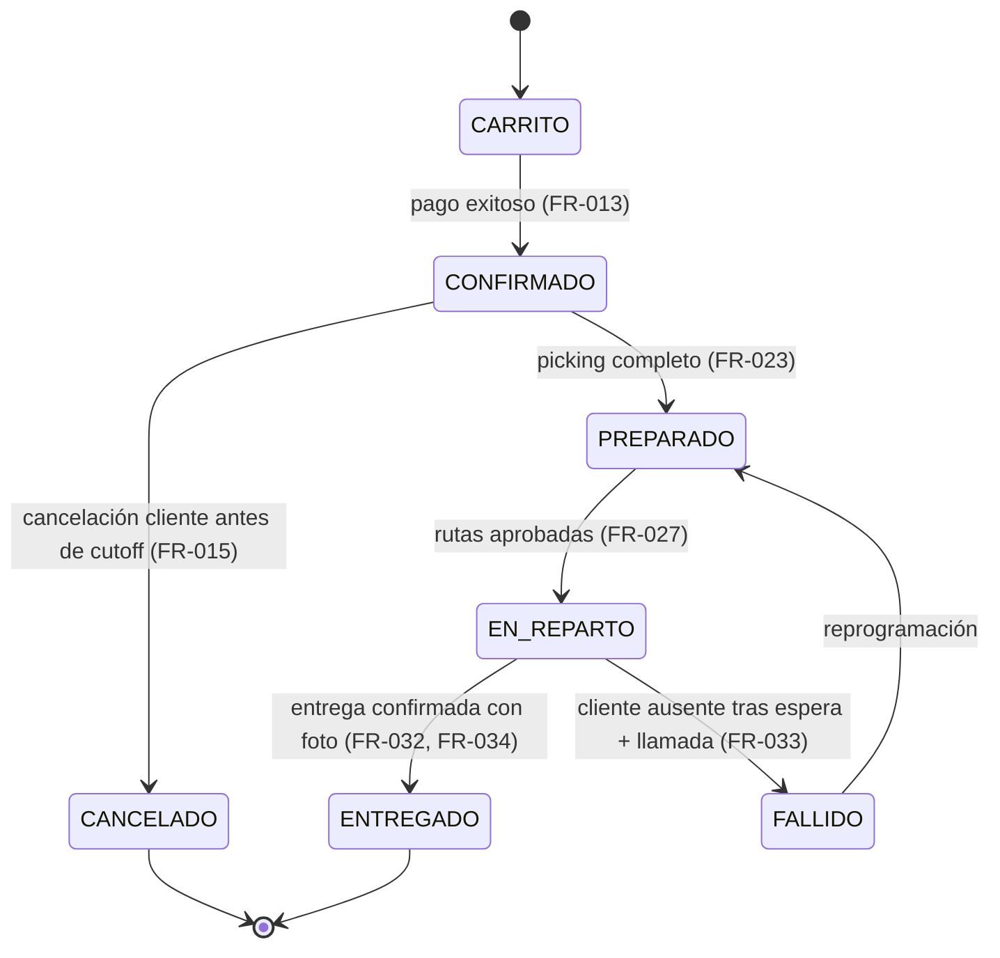

# OMS FreshDirect — Paquete de Especificación de Requisitos (SDD)

Este repositorio es un **paquete de documentación de ingeniería de requisitos**, elaborado siguiendo la metodología **Spec-Driven Development (SDD)**, para el **Order Management System (OMS)** de FreshDirect: una plataforma que **centraliza el ciclo de vida completo de un pedido de alimentación online** —desde que el cliente añade productos al carrito hasta que el repartidor confirma la entrega—, con el objetivo de reducir la tasa de error de pedidos del 12% al 2%, automatizar el picking y las rutas de reparto, y soportar sin caídas el pico de demanda de Navidad (x3 del volumen habitual).

> Este repositorio **no contiene código ejecutable**: es el conjunto de artefactos de especificación (requisitos, casos de uso, criterios de aceptación, especificaciones técnicas, contratos formales, ADRs, resiliencia, trazabilidad y validación) que serviría como base para implementar el sistema descrito.

---

## 1. Artefactos Implementados

El paquete cubre los 11 artefactos estándar de un ciclo SDD, más la entrevista fuente de la que derivan:

- **Entrevistas con stakeholders** (`entrevistas_stakeholders.md`): transcripción de las conversaciones con CEO, Operaciones, Almacén, Logística, Atención al Cliente, CTO, Calidad/Seguridad Alimentaria y Dirección Financiera, fuente primaria de todos los requisitos.
- **Documento de Requisitos** (`01-Requirements.md`): 50 requisitos funcionales (FR), 13 no funcionales (NFR), 7 regulatorios (REG) y 6 operativos (OPS), con prioridad, SLO y método de medición.
- **Casos de Uso** (`02-Use-cases.md`): 8 casos de uso end-to-end (realizar pedido, picking, rutas, entrega, incidencias, alertas sanitarias, administración).
- **Criterios de Aceptación** (`03-Acceptance-criteria.md`): escenarios BDD (Gherkin) para los FR y criterios EARS para NFR/REG/OPS.
- **Especificación Comportamental** (`04-Behavioral-specs.md`): máquina de estados del pedido, comportamiento ante fallos de dependencias externas, timeouts/reintentos y SLI/SLO/SLA.
- **Especificación Estructural** (`05-Structural-specs.md`): arquitectura de alto nivel, módulos y dependencias, modelo de datos e infraestructura.
- **Especificación Funcional** (`06-Functional-specs.md`): 14 endpoints de API documentados end-to-end (catálogo, carrito, checkout, picking, rutas, tracking, incidencias, alertas sanitarias).
- **Especificación Operativa** (`07-Operative-specs.md`): pipeline CI/CD, métricas y alertas, runbooks de incidentes, backup/DR y logging.
- **Contratos Formales** (`08-Contracts.md`): precondiciones/postcondiciones/invariantes (Design by Contract) sobre las operaciones críticas del dominio.
- **Especificación de Resiliencia** (`09-Resiliance-spec.md`): patrones de resiliencia por dependencia externa, jerarquía de degradación, feature flags, SLAs y error budget.
- **Matriz de Trazabilidad** (`10-Traceability-matrix.md`): trazabilidad FR/NFR/REG/OPS → casos de uso → criterios de aceptación → especificaciones → ADRs.
- **Puerta de Validación** (`11-Validation-gate.md`): checklist de completitud y consistencia del paquete de especificación, con supuestos documentados.
- **ADRs** (`001` a `005`): decisiones de arquitectura sobre base de datos, arquitectura general, caché/consistencia de stock, pasarela de pago y motor de rutas/picking.

## 2. Estructura del Proyecto

```
2-1-REQUIREMENTS_SPECS_EXCERCISE/
├── entrevistas_stakeholders.md          # Fuente primaria: transcripción de entrevistas con los 8 stakeholders
├── 01-Requirements.md                   # FR, NFR, REG, OPS, stakeholders y glosario del dominio
├── 02-Use-cases.md                      # 8 casos de uso principales (actor, precondiciones, flujo, postcondiciones)
├── 03-Acceptance-criteria.md            # Escenarios BDD (Gherkin) + criterios EARS
├── 04-Behavioral-specs.md               # Máquina de estados del pedido y comportamiento ante fallos
├── 05-Structural-specs.md               # Arquitectura, módulos, modelo de datos e infraestructura
├── 06-Functional-specs.md               # Contrato de los 14 endpoints de la API
├── 07-Operative-specs.md                # CI/CD, métricas/alertas, runbooks, backup/DR, logging
├── 08-Contracts.md                      # Contratos formales (Design by Contract) de operaciones críticas
├── 09-Resiliance-spec.md                # Resiliencia, degradación controlada, SLAs, error budget
├── 10-Traceability-matrix.md            # Matriz de trazabilidad extremo a extremo
├── 11-Validation-gate.md                # Checklist final de validación del paquete de especificación
├── 001-ADR-base-de-datos.md             # ADR: PostgreSQL en RDS Multi-AZ
├── 002-ADR-arquitectura-general.md      # ADR: Monolito modular en EC2 con Auto Scaling
├── 003-ADR-cache-y-consistencia-de-stock.md  # ADR: Redis como caché de lectura + descuento transaccional
├── 004-ADR-pasarela-de-pago-stripe.md   # ADR: Stripe con idempotency keys
└── 005-ADR-optimizacion-de-rutas-y-picking.md # ADR: Google Maps API con fallback determinista
```

## 3. Patrones de Diseño / Arquitectura del Sistema Especificado

Las decisiones de arquitectura del OMS descrito en esta especificación (documentadas como ADRs, sección 8.3) siguen estos patrones:

- **Monolito modular** (ADR-002): un único desplegable en EC2 con Auto Scaling, organizado en módulos internos por dominio (catálogo, checkout, picking, logística, incidencias), en lugar de microservicios desde el inicio — justificado por el timeline de 4 meses y el tamaño del equipo.
- **Cache-Aside con escritura transaccional** (ADR-003): Redis como caché de lectura de stock, con descuento transaccional en PostgreSQL como fuente de verdad, resolviendo la tensión entre NFR-005 (propagación <5s) y NFR-001/002 (rendimiento bajo carga).
- **Idempotency Key Pattern** (ADR-004): las operaciones de cobro contra Stripe usan claves de idempotencia para garantizar NFR-011 (cero cobros duplicados ante reintentos).
- **Circuit Breaker / Fallback determinista** (ADR-005, `09-Resiliance-spec.md`): frente a la API de Google Maps, el sistema degrada a un ordenamiento determinista por código postal en vez de bloquear la operación de reparto.
- **Design by Contract** (`08-Contracts.md`): las operaciones críticas del dominio (confirmar pedido, escanear producto en picking, cálculo de totales con IVA) se especifican con precondiciones, postcondiciones e invariantes explícitos y verificables.

### 3.1 Dependencias

Este repositorio es exclusivamente documentación en Markdown; no contiene código fuente, `package.json`, ni gestor de paquetes, por lo que **no aplica un lockfile** (`package-lock.json`, `poetry.lock`, `go.sum`, etc.). Las únicas "dependencias" son las herramientas de lectura/render de Markdown y Mermaid usadas para visualizar los diagramas de este paquete.

## 4. Cómo Funciona

El flujo de trabajo de este repositorio sigue el ciclo **Spec-Driven Development**: cada documento consume al anterior como entrada y añade una capa de detalle, hasta llegar a una matriz de trazabilidad y una puerta de validación que certifican que ningún requisito quedó sin cubrir. Un requisito funcional nace en `01-Requirements.md`, se concreta en un caso de uso (`02-Use-cases.md`) y en un escenario BDD (`03-Acceptance-criteria.md`), y termina verificado por un contrato formal (`08-Contracts.md`):

```gherkin
Feature: Búsqueda y carrito de compra (FR-001, FR-002, FR-003, FR-004, FR-005)
  Como Cliente
  Quiero buscar productos y añadirlos al carrito con su stock e IVA correctos
  Para confiar en que lo que compro está realmente disponible

  Scenario: Última unidad disputada por dos clientes
    Given el producto "Tarta de queso" tiene 1 unidad en stock
    And dos clientes tienen esa unidad en su carrito simultáneamente
    When ambos clientes confirman el pago al mismo tiempo
    Then solo el pago confirmado primero se queda con la unidad
    And al segundo cliente el sistema le ofrece el sustituto aceptado o cancela la línea con un mensaje claro
```

## 5. Primeros Pasos

**Requisitos previos:**
- Un lector de Markdown con soporte de tablas (VS Code, GitHub, GitLab, o cualquier visor Markdown estándar).
- (Opcional) Soporte de diagramas Mermaid para futuras ampliaciones del documento comportamental.

**Clonar el repositorio:**

```bash
# GitHub
git clone https://github.com/Jorgeaapaz/MISEIA_2-1-requisitos-y-especificacion.git

# GitLab
git clone https://gitlab.codecrypto.academy/jorgeaapaz/MISEIA_2-1-requisitos-y-especificacion.git
```

**Navegación recomendada:**

```bash
cd MISEIA_2-1-requisitos-y-especificacion
# Leer en orden: 01 → 11, empezando por el documento de requisitos
```

## 6. Ejemplos de Salida (Documentos Representativos)

**Caso de éxito — Contrato formal de `confirmarPedido` (`08-Contracts.md`):**

```
Precondiciones: carrito con líneas, reservas de stock vigentes, dirección en cobertura, idempotencyKey no reutilizado con resultado distinto de "pendiente".
Postcondiciones: si el pago fue exitoso, existe un Pedido CONFIRMADO con el mismo total cobrado en Stripe; el stock queda descontado en firme; se envía exactamente una notificación (nunca cero, nunca duplicada).
Invariante: totalPagado === totalBaseImponible + totalIVA.tipo4 + totalIVA.tipo10 + totalIVA.tipo21 (siempre).
```

**Caso de fallo / borde — transición inválida de la máquina de estados (`04-Behavioral-specs.md`):**

```
Desde: CONFIRMADO (post-cutoff) → Hacia (rechazada): CANCELADO
Razón: el cutoff de las 22:00 bloquea cambios/cancelación por autoservicio; requiere gestión manual de excepción.
```

## 7. Requisitos

### 7.1 Requisitos Funcionales (extracto representativo — ver los 50 completos en `01-Requirements.md`)

```
FR-001: El Cliente shall poder buscar productos por categoría, nombre o código de barras y shall recibir resultados que reflejen el stock disponible en tiempo real, so that no vea productos que luego no puede comprar.
FR-005: El sistema shall validar la disponibilidad de stock en tiempo real al confirmar el pedido y shall impedir la confirmación de líneas sin stock, so that no se generen pedidos que no se puedan servir.
FR-013: El sistema shall confirmar el pedido (estado CONFIRMADO) únicamente si el pago se ha completado con éxito, sin generar cobros duplicados en reintentos, so that el cliente nunca sea cobrado dos veces por el mismo pedido.
FR-019: El sistema shall descontar el stock del producto escaneado en el momento del escaneo, so that el catálogo visible al cliente refleje el inventario real del almacén.
FR-020: El sistema shall indicar al Operario de Almacén el lote a recoger siguiendo la política FEFO, siempre que conserve al menos 3 días de margen, so that se minimice la merma por caducidad.
FR-025: El sistema shall asignar automáticamente los pedidos PREPARADOS a rutas de reparto optimizando el orden de entrega, so that se reduzca el tiempo y coste de reparto.
FR-032: El Repartidor shall confirmar cada entrega adjuntando una fotografía como prueba, so that se elimine la dependencia de confirmación manual por WhatsApp.
FR-038: El sistema shall generar un reembolso automático inmediato cuando el importe de la incidencia sea inferior a 10€ con fotografía adjunta, so that se agilice la resolución de incidencias menores.
FR-044: El sistema shall permitir identificar en menos de 4 horas todos los pedidos y Clientes afectados por un lote específico, so that se pueda actuar ante una alerta sanitaria dentro del plazo regulatorio.
FR-046: El sistema shall recibir y registrar la temperatura de cada furgoneta cada 5 minutos y shall alertar al Coordinador si la zona de congelados supera -15°C, so that se garantice la cadena de frío.
```

### 7.2 Requisitos No Funcionales (extracto — 13 NFR completos en `01-Requirements.md`)

```
NFR-PERF-001: p95 de tiempo de respuesta de API < 500ms sostenido a 1.000 pedidos/día → verificado con load test k6 en staging.
NFR-PERF-002: latencia de propagación de descuento de stock < 5 segundos desde el escaneo → test de integración escaneo→catálogo.
NFR-SEC-001: 0 datos de tarjeta (PAN completo, CVV) almacenados o logueados en sistemas propios → auditoría de logs/esquema + escaneo automatizado en CI.
NFR-SCAL-001: soporte de 3.000 pedidos/día (x3 sobre temporada normal) con 0 incidentes de caída entre el 1 nov y el 31 ene → load test de pico + simulacro previo a temporada alta.
NFR-USAB-001: tiempo medio de picking por pedido < 5 minutos (frente a 8-12 min actuales) → medición de timestamps inicio/fin en producción.
NFR-AVAIL-001: ≤ 1 hora de downtime/mes en temporada normal; 0 minutos de downtime no planificado en temporada alta → monitorización de uptime con SLA mensual.
NFR-MAINT-001: la aplicación de picking en tablet sigue operativa durante pérdida de conexión, con sincronización íntegra en < 30s al reconectar → test de desconexión simulada en staging.
NFR-OBS-001: alertas de degradación disparadas con al menos 5 minutos de antelación a un fallo total conocido → dashboards con umbrales (ver `07-Operative-specs.md`).
NFR-SEC-002: 0 cobros duplicados detectados por reintento de pago → test de idempotencia + idempotency keys de Stripe.
NFR-SCAL-002: 0 casos de sobreventa (stock negativo) detectados en producción → test de concurrencia sobre el mismo SKU en staging.
```

### 7.3 Requisitos Regulatorios (México)

Si bien el dominio original (`01-Requirements.md`, sección 5) documenta normativa española (Reglamento CE 178/2002, GDPR, PCI DSS, LSSI-CE, IVA español), a continuación se listan los requisitos regulatorios equivalentes que aplicarían si el sistema operara en México:

```
REG-MX-001: El sistema shall cumplir con la Ley Federal de Protección de Datos Personales en Posesión de los Particulares (LFPDPPP) en el tratamiento de los datos personales del Cliente (nombre, dirección, teléfono, email), incluyendo aviso de privacidad y derechos ARCO.
REG-MX-002: El sistema shall emitir Comprobantes Fiscales Digitales por Internet (CFDI 4.0) válidos ante el SAT por cada pedido entregado, desglosando IVA (16% general, 0% en alimentos básicos según LIVA) y usando el RFC del Cliente cuando se proporcione.
REG-MX-003: El sistema shall delegar el procesamiento y almacenamiento de datos de pago en un proveedor certificado PCI DSS y shall evitar almacenar o loguear datos sensibles de tarjeta, en cumplimiento de las disposiciones de la CONDUSEF y el Banco de México para medios de pago electrónicos.
```

### 7.4 Requisitos Operativos (extracto — 6 OPS completos en `01-Requirements.md`)

```
OPS-001: El sistema shall contar con un pipeline de CI/CD que ejecute lint, tests y build antes de desplegar a staging, con aprobación manual antes de desplegar a producción y rollback automático si el error rate supera el 1% en 5 minutos.
OPS-002: El sistema shall exponer métricas de infraestructura y negocio (latencia, tasa de error, pedidos/hora, fallos de picking) con alertas configuradas sobre umbrales críticos, notificando en menos de 2 minutos.
OPS-003: El sistema shall contar con backup incremental diario y completo semanal, retenido 30 días, con RTO < 4 horas y RPO < 1 hora, verificado mediante simulacro trimestral de recuperación ante desastres.
OPS-004: El sistema shall ejecutar automáticamente cada noche a las 02:00 el export de pedidos/facturas a CSV para SAP, con reintento automático si falla.
OPS-005: El sistema shall operar dentro de una ventana de disponibilidad total (24/7) durante la temporada alta (noviembre-enero), sin ventanas de mantenimiento planificado en ese periodo.
```

### 7.5 Atributos de Calidad

### 7.5.1 Performance: Latencia de API [PERF-API-LATENCY]
**Quality Attribute:** Performance
**Metric:** Latencia (ms)

**Specification:**
- p99: < 800ms
- p95: < 500ms
- p50: < 150ms

**Conditions:**
- Carga: 1.000 pedidos/día sostenidos (temporada normal)
- Entorno: staging equivalente a producción (EC2 + RDS)

**Exceptions:**
- Pico de Navidad (x3 volumen): p95 aceptable hasta 900ms durante el simulacro previo a temporada alta

**Verification:** Load test con k6, medición en CloudWatch/Prometheus.

### 7.5.2 Scalability: Volumen de Pedidos [SCAL-ORDER-VOLUME]
**Quality Attribute:** Scalability
**Metric:** Pedidos/día soportados sin degradación

**Specification:**
- Temporada normal: 1.000 pedidos/día
- Temporada alta: 3.000 pedidos/día (x3) sin caídas

**Conditions:**
- Auto Scaling en EC2 activado por CPU > 70% durante 2 minutos
- Base de datos PostgreSQL en RDS Multi-AZ

**Exceptions:**
- Ninguna excepción aceptada entre el 1 de noviembre y el 31 de enero (ventana crítica de negocio)

**Verification:** Load test de pico sostenido + simulacro de Black Friday/Navidad previo a temporada alta.

### 7.5.3 Reliability: Consistencia de Stock [RELI-STOCK-CONSISTENCY]
**Quality Attribute:** Reliability
**Metric:** Casos de sobreventa (stock negativo)

**Specification:**
- 0 casos de sobreventa en producción
- Propagación de descuento de stock < 5s desde el escaneo

**Conditions:**
- Descuento transaccional en PostgreSQL, caché de lectura en Redis (ver ADR-003)
- Concurrencia simultánea sobre el mismo SKU

**Exceptions:**
- Ninguna: la resolución de la última unidad siempre favorece al primer pago confirmado

**Verification:** Test de concurrencia en staging (carga simultánea sobre el mismo SKU).

### 7.5.4 Availability: Continuidad en Temporada Alta [AVAIL-PEAK-SEASON]
**Quality Attribute:** Availability
**Metric:** Minutos de downtime no planificado

**Specification:**
- Temporada normal: ≤ 1 hora de downtime/mes
- Temporada alta (nov-ene): 0 minutos de downtime no planificado

**Conditions:**
- Monitorización de uptime en tiempo real (CloudWatch Synthetics/Pingdom)
- Postmortem obligatorio ante cualquier incidente

**Exceptions:**
- Ventanas de mantenimiento planificado y comunicadas con antelación, fuera de temporada alta

**Verification:** Reporte mensual de SLA, dashboard de uptime.

### 7.5.5 Security: Protección de Datos de Pago [SEC-PAYMENT-DATA]
**Quality Attribute:** Security
**Metric:** Datos de tarjeta almacenados/logueados

**Specification:**
- 0 PAN completo o CVV almacenado en sistemas propios
- 0 datos sensibles de tarjeta en logs de aplicación

**Conditions:**
- Procesamiento de pago delegado a Stripe (PCI DSS)
- Enmascarado de campos sensibles antes de loguear

**Exceptions:**
- Ninguna

**Verification:** Auditoría de logs y esquema de base de datos, escaneo automatizado en CI.

### 7.6 Criterios de Aceptación BDD para Requisitos Funcionales

```gherkin
Feature: Confirmación de pedido y no doble cobro (FR-013)
  Scenario: Reintento de pago tras timeout de red
    Given el Cliente confirma el pago y la petición sufre un timeout de red antes de recibir respuesta
    And el Cliente reintenta la confirmación con el mismo idempotencyKey
    When el sistema procesa el reintento
    Then Stripe no genera un segundo cargo
    And el pedido queda en estado CONFIRMADO exactamente una vez

Feature: Picking con política FEFO (FR-020, FR-021)
  Scenario: Producto próximo a caducar se excluye del picking
    Given el lote "L-2024-118" de "Yogur natural" caduca hoy + 1 día
    When el Operario de Almacén solicita el siguiente producto a recoger
    Then el sistema no ofrece ese lote para picking
    And el sistema indica el siguiente lote disponible con al menos 3 días de margen

Feature: Alerta sanitaria de lote (FR-044, FR-045)
  Scenario: Notificación a clientes afectados dentro del plazo regulatorio
    Given un lote específico es señalado por una alerta sanitaria
    When el sistema identifica los pedidos y Clientes asociados a ese lote
    Then la identificación se completa en menos de 4 horas
    And se envía notificación urgente (email + SMS) a cada Cliente afectado
    And el sistema registra el envío y la recepción de cada notificación

Feature: Entrega con cliente ausente (FR-033)
  Scenario: Cliente no responde tras la espera y llamada
    Given el Repartidor llega a la dirección de entrega y el Cliente no está presente
    When el Repartidor espera 5 minutos e intenta contactar telefónicamente sin respuesta
    Then el sistema marca la entrega como FALLIDO
    And los productos de cadena de frío se marcan como no reentregables

Feature: Reembolso automático por incidencia menor (FR-038, FR-039)
  Scenario: Incidencia por debajo del umbral con fotografía
    Given el Cliente reporta un producto dañado con importe de 7€ y adjunta fotografía
    And el Cliente no ha alcanzado el máximo de 2 reembolsos automáticos ese mes
    When el sistema procesa la incidencia
    Then se genera un reembolso automático inmediato sin intervención de un Agente de Soporte
```

## 8. Especificaciones

### 8.1 Specification-Driven Development

**Functional Specs** (`06-Functional-specs.md`) — contrato de 14 endpoints de la API. Ejemplo (`POST /checkout/confirmar-pedido`):

```
## Use Case: Confirmar Pedido
**Actors:** Cliente, Pasarela de Pago (Stripe)

**Preconditions:**
- Carrito con líneas y stock reservado vigente
- Dirección validada en zona de cobertura

**Main Flow:**
1. Cliente confirma el pedido con método de pago
2. Sistema calcula totales con IVA desglosado
3. Sistema cobra vía Stripe con idempotency key
4. Sistema crea Pedido en estado CONFIRMADO
5. Sistema descuenta stock reservado en firme
6. Sistema envía confirmación por email y SMS

**Acceptance Criteria:**
- Given carrito válido con stock reservado
- When el pago se completa con éxito
- Then el pedido queda CONFIRMADO con el total exacto cobrado
- And el stock queda descontado en firme, no solo reservado
```

**Structural Specs** (`05-Structural-specs.md`) — define la arquitectura de alto nivel (monolito modular en EC2 + Auto Scaling, RDS PostgreSQL Multi-AZ, Redis, colas), los módulos internos por dominio y sus dependencias, el modelo de datos (Pedido, Línea, Producto, Lote, Ruta, Incidencia, etc.) y la infraestructura AWS.

**Behavioral Specs** (`04-Behavioral-specs.md`) — máquina de estados del pedido:



**Operative Specs** (`07-Operative-specs.md`) — pipeline CI/CD, métricas Prometheus, reglas de alerta y runbooks. Ejemplo:

```
# Spec Operativa: OMS FreshDirect

## Despliegue
- Pipeline con lint + tests + build antes de staging
- Aprobación manual antes de producción
- Rollback automático si error rate > 1% en 5 min

## Escalado
- Horizontal en EC2 vía Auto Scaling
- Trigger: CPU > 70% por 2min -> +instancias

## Monitoreo
- Latency p95 < 500ms
- Downtime no planificado = 0 min en temporada alta

## Runbook: Tasa de Error de Pago Elevada (Stripe)
1. Verificar estado del servicio de Stripe (status page)
2. Revisar logs de idempotency keys rechazadas
3. Si persiste: activar degradación a cobro diferido
4. Escalar al CTO si supera 15 minutos
```

### 8.2 Invariantes y Contratos

`08-Contracts.md` documenta contratos formales (Design by Contract) sobre las operaciones críticas del dominio. Ejemplo — función pura de cálculo de totales:

```
CONTRATO PARA calcularTotalesConIVA:

PRECONDICIÓN:
- lineas: LineaPedido[] no nulo
- cada línea tiene cantidad > 0 y tipoIVA ∈ {4, 10, 21}

POSTCONDICIÓN:
- retorna { totalBaseImponible, totalIVA: { tipo4, tipo10, tipo21 }, totalPagado }
- totalPagado === totalBaseImponible + totalIVA.tipo4 + totalIVA.tipo10 + totalIVA.tipo21
- la función no muta el array de entrada

INVARIANTE:
- el número de líneas procesadas no cambia el resultado si se reordenan
- ningún importe parcial es negativo

EJEMPLO:
- calcularTotalesConIVA([{precio:10, cantidad:2, tipoIVA:4}]) → { totalBaseImponible: 20, totalIVA:{tipo4:0.8,...}, totalPagado: 20.8 }
- calcularTotalesConIVA([]) → { totalBaseImponible: 0, totalIVA:{tipo4:0,tipo10:0,tipo21:0}, totalPagado: 0 }
```

### 8.3 ADRs (Architecture Decision Records)

| ADR | Decisión | Justificación cuantitativa/cualitativa |
|---|---|---|
| **ADR-001** — Base de datos | PostgreSQL en RDS Multi-AZ | Transaccionalidad ACID necesaria para descuento de stock e idempotencia de pago; Multi-AZ evita punto único de fallo, alineado con NFR-004 (0 downtime no planificado en temporada alta) |
| **ADR-002** — Arquitectura general | Monolito modular en EC2 con Auto Scaling | Timeline de 4 meses y equipo reducido hacen inviable operar microservicios desde el día uno; Auto Scaling cubre NFR-002 (x3 tráfico en Navidad) sin la complejidad operativa de Kubernetes |
| **ADR-003** — Cache y consistencia de stock | Redis como caché de lectura + descuento transaccional en PostgreSQL | Resuelve la tensión entre NFR-005 (propagación de stock < 5s) y NFR-001/002 (rendimiento bajo carga de pico), evitando escrituras síncronas bloqueantes en cada consulta de catálogo — previene el agotamiento de conexiones a la base de datos bajo picos de tráfico |
| **ADR-004** — Pasarela de pago | Stripe con idempotency keys | Garantiza NFR-011 (0 cobros duplicados); descartada Redsys por integración más costosa y sin idempotencia nativa equivalente |
| **ADR-005** — Rutas y picking | Google Maps API con fallback determinista propio | Evita depender de un motor VRP propio (fuera de alcance del MVP en 4 meses) manteniendo NFR-009 (continuidad operativa si el proveedor de geolocalización falla), mediante un ordenamiento determinista por código postal como degradación controlada |

**Consulta completa:** cada ADR incluye `Status`, `Context`, `Decision`, `Alternatives Considered`, `Consequences` (positivas/negativas/riesgos) y `Decision Makers` en su archivo correspondiente (`001` a `005`).

## 9. Verificación del Paquete de Especificación

Este repositorio no contiene código fuente ni pruebas automatizadas de software (no hay `package.json`, carpeta `tests/` ni `__tests__/`), ya que es un artefacto de especificación, no una aplicación. El equivalente funcional a una suite de pruebas es:

- **Criterios de Aceptación BDD/EARS** (`03-Acceptance-criteria.md`): cubren el 100% de los 50 FR con escenarios Gherkin y los 13 NFR + 7 REG + 6 OPS con criterios EARS — el equivalente a "pruebas" que cualquier implementación futura debería satisfacer.
- **Matriz de Trazabilidad** (`10-Traceability-matrix.md`): verifica que cada requisito tiene un caso de uso, un criterio de aceptación, una especificación y (cuando aplica) un ADR asociado — sin huecos de cobertura.
- **Puerta de Validación** (`11-Validation-gate.md`): checklist final que confirma consistencia entre los 11 artefactos y documenta explícitamente los supuestos asumidos donde las entrevistas no eran concluyentes.

Para "ejecutar" esta verificación sobre el paquete:

```bash
# Revisar que cada FR de 01-Requirements.md tenga entrada en la matriz de trazabilidad
grep -o "FR-[0-9]*" 01-Requirements.md | sort -u > /tmp/fr_declarados.txt
grep -o "FR-[0-9]*" 10-Traceability-matrix.md | sort -u > /tmp/fr_trazados.txt
diff /tmp/fr_declarados.txt /tmp/fr_trazados.txt
```

## 10. Publicación

### 10.1 Repositorios públicos

```
GitHub: https://github.com/Jorgeaapaz/MISEIA_2-1-requisitos-y-especificacion
GitLab: https://gitlab.codecrypto.academy/jorgeaapaz/MISEIA_2-1-requisitos-y-especificacion
```

### 10.2 Lockfile

No aplica: este repositorio no tiene dependencias de código (no hay `package.json`, `poetry.lock`, `Pipfile.lock`, `pom.xml` ni `go.sum`), por lo que no existe superficie de instalación que fijar.

### 10.3 Instrucciones de "despliegue" (publicación de la documentación)

```bash
# Clonar
git clone https://github.com/Jorgeaapaz/MISEIA_2-1-requisitos-y-especificacion.git
cd MISEIA_2-1-requisitos-y-especificacion

# Publicar/actualizar en GitHub
git add -A
git commit -m "Actualiza especificación"
git push origin master

# Publicar/actualizar en GitLab (remoto adicional)
git remote add gitlab https://gitlab.codecrypto.academy/jorgeaapaz/MISEIA_2-1-requisitos-y-especificacion.git
git push gitlab master
```

No se requiere Dockerfile ni infraestructura cloud propia: la "publicación" consiste en el propio repositorio Git alojado en GitHub/GitLab, legible directamente como Markdown renderizado.

## 11. Mejoras

Funcionalidades que extenderían el valor de este paquete de especificación:

- **Generar un contrato OpenAPI/Swagger** a partir de `06-Functional-specs.md` para permitir mocking automático de los 14 endpoints antes de implementarlos.
- **Renderizar los diagramas Mermaid** (máquina de estados, sección 8.1) en una página estática (p. ej. GitHub Pages) para navegación visual del paquete completo.
- **Exportar la matriz de trazabilidad** (`10-Traceability-matrix.md`) a una vista filtrable (CSV/hoja de cálculo) para auditorías de cobertura de requisitos.
- **Añadir un pipeline de CI** que valide automáticamente que todo ID de requisito (FR/NFR/REG/OPS) referenciado en un documento existe en `01-Requirements.md`, evitando referencias rotas entre artefactos.

## 12. Cambios Documentados

Todo el contenido de este repositorio (entrevistas, requisitos, casos de uso, especificaciones, contratos, ADRs, resiliencia, trazabilidad y validación) fue generado con asistencia de IA (Claude, mediante la skill `requirements-analyst`) a partir del archivo fuente de entrevistas con los stakeholders de FreshDirect, siguiendo la metodología SDD. Cambios realizados en esta sesión:

1. **Generación del paquete completo de especificación** a partir de `entrevistas_stakeholders.md`: se derivaron 50 FR, 13 NFR, 7 REG y 6 OPS con trazabilidad explícita a las citas de los stakeholders que los originan.
2. **Publicación en dos repositorios remotos** (GitHub y GitLab) mediante `gh` y `glab`, incluyendo inicialización de Git, commit inicial y push a ambos.
3. **Creación de este `README.md`** en español, documentando el paquete completo con su estructura real de archivos, extractos fieles de cada documento (no contenido inventado) y una adaptación honesta de las secciones de "pruebas" y "despliegue" a la naturaleza documental (no ejecutable) del repositorio.

**Revisión crítica explícita:**

- **Fidelidad del contenido:** cada extracto de requisito, escenario BDD, contrato o ADR incluido en este README fue verificado contra el archivo fuente correspondiente antes de citarlo (no se generó contenido nuevo de dominio para el README); la evidencia son los números de línea consultados en `01-Requirements.md`, `03-Acceptance-criteria.md`, `04-Behavioral-specs.md` y `08-Contracts.md` durante su redacción.
- **Adaptación de la plantilla estándar:** la plantilla original de README asume una aplicación de software con código, dependencias y despliegue ejecutable. Este repositorio es un artefacto de especificación puro; en lugar de fabricar código o pruebas inexistentes, las secciones 9 y 10 se reinterpretaron explícitamente hacia sus equivalentes documentales reales (criterios de aceptación como "pruebas", repositorios Git como "despliegue"), dejando constancia de la ausencia de lockfile y de suite de pruebas de software en vez de omitirla silenciosamente.
- **Requisitos regulatorios para México (sección 7.3):** dado que el dominio real de la especificación es España (normativa citada en `01-Requirements.md` es española), los tres requisitos regulatorios mexicanos se presentan explícitamente como una traducción funcional equivalente (LFPDPPP ≈ GDPR, CFDI ≈ facturación electrónica española, CONDUSEF/Banxico ≈ PCI DSS/LSSI-CE) y no como requisitos ya validados con un stakeholder mexicano real — esta distinción se marca para evitar que se interprete como parte del alcance original del proyecto.
